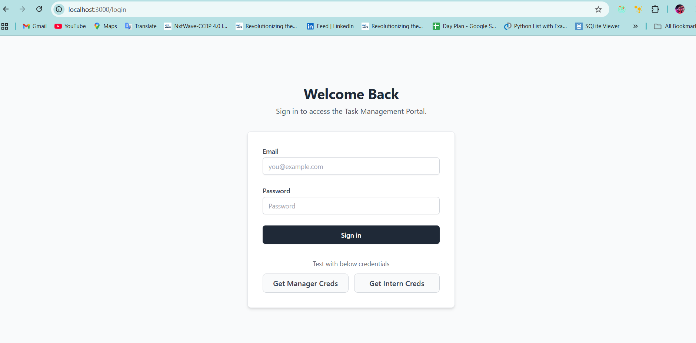
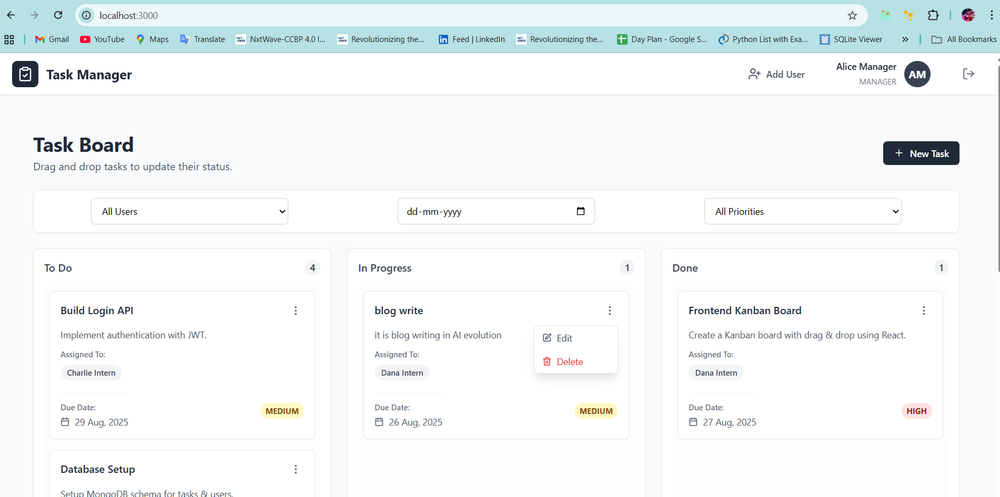
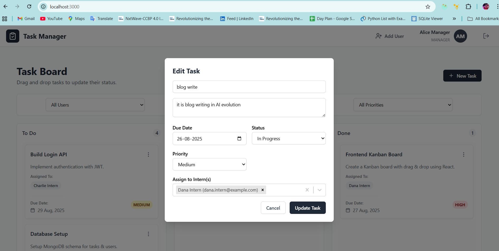
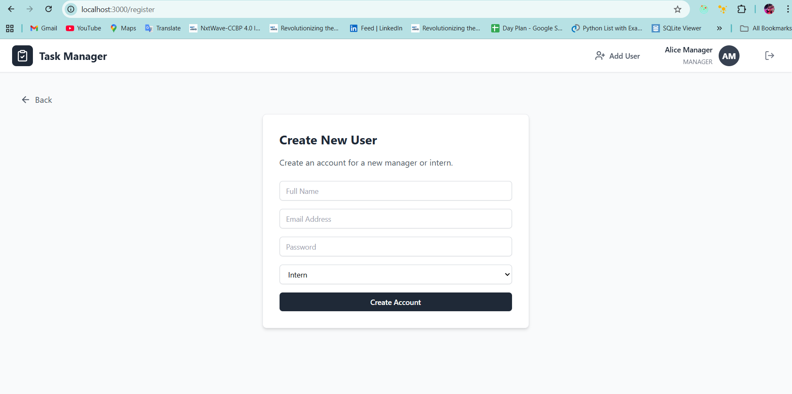
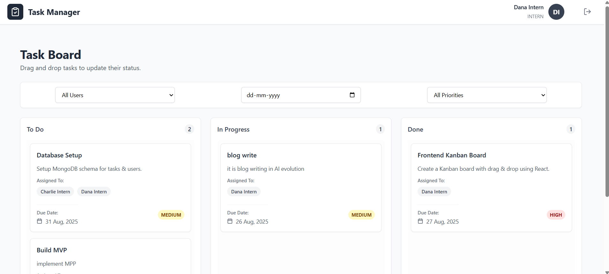

# Internship Task Management Portal

This is a full-stack Kanban-style task management system designed for organizations to assign, track, and manage tasks for interns and employees. It features distinct roles for Managers and Interns, a drag-and-drop interface, task prioritization, filtering options, and a clean, responsive design.

**Live Demo:** [Task Manager Demo](https://task-manager-jade-five.vercel.app/)
**GitHub Repository:** [https://github.com/Kalyanpandaga/task-manager](https://github.com/Kalyanpandaga/task-manager)

---

## ✨ Features

### Manager Features

- **Authentication:** Secure login system.
- **User Management:** Create new user accounts (both Managers and Interns).
- **Full Task Control:** Create, read, update, and delete any task in the system.
- **Task Assignment:** Assign or reassign tasks to any intern.
- **Task Priorities:** Set priority levels (Low, Medium, High) for tasks.
- **Global View:** View all tasks across the organization on a unified Kanban board.
- **Filtering:** Filter tasks by user, deadline, or priority.
- **Dashboard Access:** Access a dedicated page to add new users to the platform.

### Intern Features

- **Authentication:** Secure login system.
- **Personalized Dashboard:** View only the tasks that are specifically assigned to them.
- **Status Updates:** Update the status of their assigned tasks by dragging and dropping cards between columns (To Do, In Progress, Done).
- **Task Details:** View the full details of their assigned tasks, including title, description, deadline, and priority.
- **Filtering:** Apply filters to focus on tasks by deadline or priority.

### Recruiter Testing Convenience

On the **login page**, recruiters can quickly test the app using **autofill buttons**:

- **Get Manager Creds** → autofills:

  - Email: `alice.manager@example.com`
  - Password: `Manager@123`

- **Get Intern Creds** → autofills:

  - Email: `dana.intern@example.com`
  - Password: `Intern@123`

---

## 🖼️ Screenshots

### Login Page with Test Credentials



### Manager Kanban Board (All Tasks)



### Task Creation / Editing (Only Manager)



### User Creation (Only Manager)



### Intern Dashboard (Assigned Tasks Only)



---

## 🛠️ Tech Stack

### Frontend

- React.js
- Vite
- Tailwind CSS
- React Router
- TanStack Query (for server state management)
- @hello-pangea/dnd (for drag-and-drop)
- Lucide React (for icons)

### Backend

- Node.js
- Express.js
- Mongoose (MongoDB ODM)
- JSON Web Tokens (JWT) for authentication
- bcryptjs for password hashing

### Database

- MongoDB

---

## 🚀 Getting Started

Follow these instructions to set up and run the project locally on your machine.

### Prerequisites

- Node.js (v20.0.0 or higher)
- npm (or yarn)
- MongoDB (A local instance or a cloud-based service like MongoDB Atlas)

### 1. Clone the Repository

```bash
git clone https://github.com/Kalyanpandaga/task-manager.git
cd task-manager
```

### 2. Backend Setup

Navigate to the backend directory and install the required dependencies.

```bash
cd backend
npm install
```

Create a `.env` file in the backend directory and add the following environment variables:

```env
# backend/.env

# Your MongoDB connection string
MONGO_URI=mongodb+srv://<user>:<password>@<cluster-url>/<database-name>?retryWrites=true&w=majority

# Secret key for signing JWTs (choose a long, random string)
JWT_SECRET_KEY=your_super_secret_jwt_key

# The port the backend server will run on
PORT=5000

# The origin URL of your frontend application for CORS
ALLOWED_ORIGIN=http://localhost:3000
```

### 3. Seed the Database (Optional but Recommended)

To populate the database with initial sample data (users and tasks), run the seed script.

```bash
npm run seed
```

This will create managers and interns. You can also test login quickly using the login page buttons:

- **Manager Email:** `alice.manager@example.com`
  **Password:** `Manager@123`

- **Intern Email:** `dana.intern@example.com`
  **Password:** `Intern@123`

### 4. Start the Backend Server

```bash
npm run dev
```

The backend server will start on the port specified in your `.env` file (e.g., `http://localhost:5000`).

### 5. Frontend Setup

Open a new terminal, navigate to the frontend directory, and install its dependencies.

```bash
cd ../frontend
npm install
```

Create a `.env` file in the frontend directory and add the following variable, pointing to your running backend API:

```env
# frontend/.env

VITE_API_BASE_URL=http://localhost:5000/api
```

### 6. Start the Frontend Development Server

```bash
npm run dev
```

The React application will start, and you can access it in your browser, typically at `http://localhost:3000`.

You're all set! You can now log in using the provided credentials and test the application.

---

## 📝 API Endpoints

The backend exposes the following REST API endpoints:

| Method | Endpoint                   | Description                                       | Access  |
| ------ | -------------------------- | ------------------------------------------------- | ------- |
| POST   | /api/auth/login            | Authenticate a user and receive a JWT.            | Public  |
| GET    | /api/users/me              | Get the profile of the currently logged-in user.  | Private |
| GET    | /api/users                 | Get a list of all users.                          | Manager |
| POST   | /api/users/create          | Create a new user.                                | Manager |
| GET    | /api/tasks                 | Get tasks (all for Manager, assigned for Intern). | Private |
| GET    | /api/tasks/\:taskId        | Get details for a single task.                    | Private |
| POST   | /api/tasks/create          | Create a new task.                                | Manager |
| PUT    | /api/tasks/update/\:taskId | Update an existing task (status, priority, etc.). | Private |
| DELETE | /api/tasks/delete/\:taskId | Delete a task.                                    | Manager |

---

## 📌 Highlights for Recruiters

- **Quick login testing buttons** on login page → No need to type credentials manually.
- **Task Priority Levels** with color-coded badges for easy visibility.
- **Filters** by User, Deadline, and Priority for better task tracking.
- Assign and re-assign multiple users to single task
- Clean, responsive **UI/UX** with drag-and-drop board.
- Screenshots included for a visual walkthrough.

---
